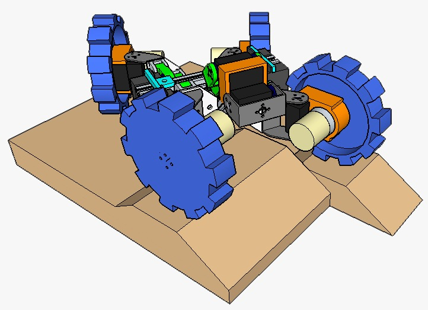
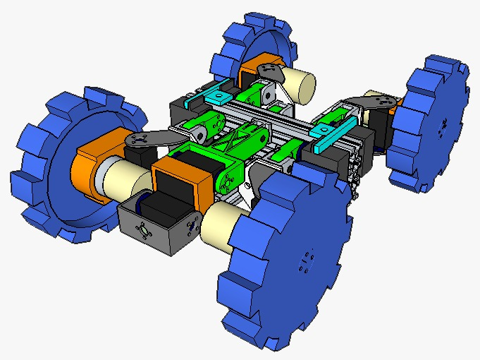
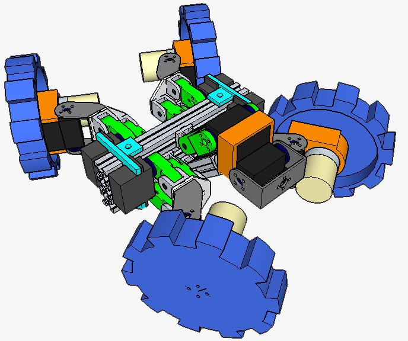
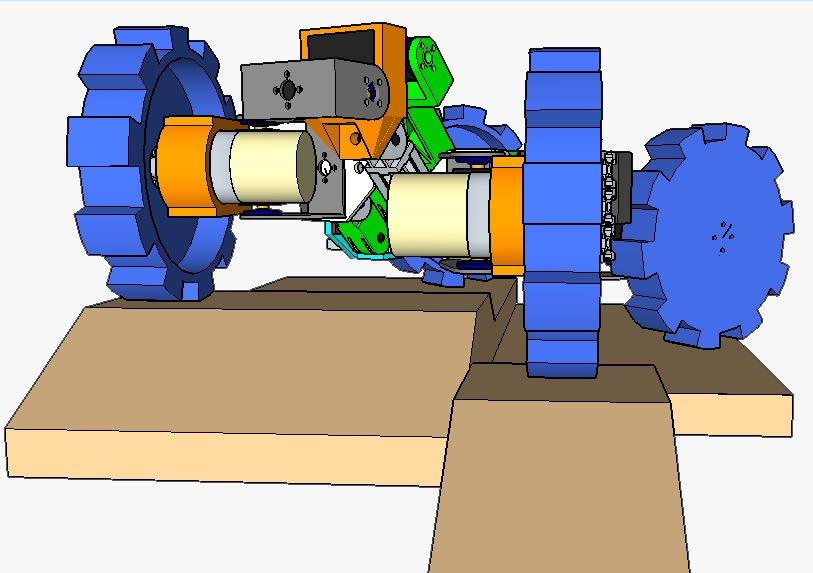

# TDM

**Logistical info**

>Team Name: Intelligent Systems Laboratory

>Organisation: Technological University of Panama

>Country:Panama

>Contact person: Dr. Danilo Caceres

>Email: danilo.caceres@utp.ac.pa 

>Team website: https://github.com/wggm01/ISL-RMRC-Intelligent-Systems-Laboratory

.

**Introduction summarising:**

>The team: Kelvin Kung,3rd year; Gabriel Marzullo, 5th year; Wvaldo Graell, 5th year; Danilo Caceres, Ph.D., Faculty mentor.
 

>The technical aspects that it focuses on: Gabriel Marzullo is designing a robot arm and improving the current structure of robot, Wvaldo Graell is making the code to control the robot wireless via wifi and implementing OpenCv library to do image recognition, Kelvin Kung is actually working on the code to control the movements of Robot.

.

**System description, describing:**

>Hardware: Our robot is designed to be capable of elevating itself overpassing high obstacles and make precise turns using multiples analogic servos controlled by a multi servos board that is directly connected to an Arduino Mega via UART (Robot arm is controlled with a multi servos board via UART) in addition count with 4 High Torque DC motors controlled with an H-bridge. The robot also has a laptop webcam and a RpiCam, one for image recognition allocated in the robot arm and the other one to drive the robot those cameras are connected to an Asus Tinker Board and stream via Wifi to the base station. another feature that we are thinking to add is an inertial measurement unit to keep the robot stable and four distance sensor to has more control over the robot.

>Software: We are using Pycharm community version to code Python scripts, Arduino IDE, and a Linux based operating system to run the python scripts in the Asus Tinker Board.

>Communications: The robot use the Asus Tinker Wifi  built in to communicate with the base station using the 5Ghz band using sockets. 

>Human-robot interface: The base station is just a laptop running processing executables that shows the video from the cameras and the data from the sensor once implemented.

.

**Application, describing:**

>Setup and packup of your robot and operator station: The operator just will be a laptop and can the robot will be carried in a suit case that gives enogugh space to put all the accesories.

>Mission strategy: Danilo

>Experiments and testing that you have done or will do: we are planing to test the robot in diferents grounds to make sure that the robot is capable of goes through it using the cameras as the principal way to navigate the robot.

>How the particular strengths of your team are relevant to applications in the field: Danilo

.

**Conclusion:**

>What your team has learned so far:Danilo

.

**Appendix:**

 Component | Estimated Cost
 ----------|----------------
[4x Servo Bracket](https://www.amazon.com/LewanSoul-LD-220MG-Digital-Bearing-Aluminium/dp/B07CMBMWZW/ref=sr_1_7?ie=UTF8&qid=1548035324&sr=8-7&keywords=servo+bracket)| $20.00
[4x Digital Servo Dual Ball Bearing](https://www.amazon.com/LewanSoul-LD-220MG-Digital-Bearing-Aluminium/dp/B07CMBMWZW/ref=sr_1_7?ie=UTF8&qid=1548035324&sr=8-7&keywords=servo+bracket)| $88.00
[4x Digital Servo](https://www.amazon.com/d/Rc-Servos/ANNIMOS-Digital-Waterproof-DS3218MG-Control/B076CNKQX4/ref=sr_1_3?ie=UTF8&qid=1548270718&sr=8-3&keywords=20kg+servo)|$72.00
[1x Servo Horn Arm](https://www.amazon.com/Seamuing-Aluminum-Futaba-Mechanical-Helicopter/dp/B07D56FVK5/ref=sr_1_5?ie=UTF8&qid=1548270793&sr=8-5&keywords=25T+disc)|$9.00
[1x Flange Shaft Coupling](https://www.amazon.com/Magic-Coupling-Hardness-Accessory-Connector/dp/B07FLWQMNW/ref=sr_1_2_sspa?ie=UTF8&qid=1548271049&sr=8-2-spons&keywords=6mm+shaft&psc=1)|$24.00
[1x Joining Bracket Plate ](https://www.amazon.com/Joining-Bracket-Aluminum-Extrusion-Profile/dp/B01H6NPID2/ref=sr_1_16?ie=UTF8&qid=1548271256&sr=8-16&keywords=2020+profile+aluminum+joint+plate)|$14.00
[1x Alloy Pivot Joint](https://www.amazon.com/IZTOSS-Die-Cast-Aluminum-Extrusion-Profile/dp/B078RH97L3/ref=sr_1_4?ie=UTF8&qid=1548271696&sr=8-4&keywords=2020+profile+aluminum+pivot)|$63.00
[1x M5 Slide in T Nut](https://www.amazon.com/Boeray-Aluminum-Extrusion-Profile-Sereis/dp/B01GCDG2QO/ref=sr_1_8?ie=UTF8&qid=1548271800&sr=8-8&keywords=2020+profile+aluminum)|$10.00
[4x DC 12V 100RPM Gear Motor ](https://www.amazon.com/Greartisan-Electric-Reduction-Centric-Diameter/dp/B072R57C56/ref=sr_1_6?ie=UTF8&qid=1548271877&sr=8-6&keywords=dc%2Bgear%2Bmotor&th=1)|$64.00
[1x Stainless Steel Flat Head Hex](https://www.amazon.com/Hilitchi-510pcs-Stainless-Socket-Assortment/dp/B073SVMX3T/ref=sr_1_5?ie=UTF8&qid=1548272606&sr=8-5&keywords=m3+m4+m5+flat+head)|$15.00
[3x Aluminum Profiles](https://www.amazon.com/Linear-Motion-Aluminum-Profiles-Extrusion/dp/B07MMX1QW9/ref=sr_1_1?ie=UTF8&qid=1548272841&sr=8-1&keywords=2060+t-slot+200mm)|$45.00
[1x ASUS Tinker Board Quad-Core](https://www.amazon.com/gp/product/B00FS83U42/ref=ox_sc_saved_title_1?smid=ATVPDKIKX0DER&psc=1)|$85.25
[1x Mini Maestro 18-Channel USB Servo Controller](https://www.pololu.com/product/1354)|$39.95
[2x Dual MAX14870 Motor Driver Shield for Arduino](https://www.pololu.com/product/2519)|$25.50
[1x Arduino Mega ](https://www.amazon.com/ARDUINO-MEGA-2560-REV3-A000067/dp/B0046AMGW0/ref=sr_1_3?s=pc&ie=UTF8&qid=1550887800&sr=1-3&keywords=ARDUINO+MEGA)|$33.88
[1x Logic level converter](https://www.amazon.com/Cylewet-3-3V-5V-Channels-Converter-Bi-Directional/dp/B074M8TM81/ref=sr_1_3?ie=UTF8&qid=1550887969&sr=8-3&keywords=logic+level+shifter+3.3v+to+5v)|$15.29
[1x Pololu 3.3v, 2.5A Step-Down Voltage Regulator D24V25F](https://www.pololu.com/product/2849)|$10.95
[1x Pololu 5v, 2.5A Step-Down Voltage Regulator D24V25F](https://www.pololu.com/product/2850)|$21.90
[1x AltIMU-10 v3 Gyro, Accelerometer, Compass, and Altimeter](https://www.pololu.com/product/2469)|$13.91
[4x Pololu Carrier with Sharp GP2Y0A60SZLF Analog Distance Sensor 10-150cm,5v](https://www.pololu.com/product/2474)|$51.80
[1x Camera Module for Tinker Board](https://www.amazon.com/Camera-Module-Tinker-Board-Adjustable/dp/B07916CXJX)|$25.99
[1x Pixy2 Smart Vision Sensor](https://www.amazon.com/Pixy2-Smart-Vision-Sensor-BeagleBone/dp/B07D1CLYD2/ref=sr_1_1_sspa?s=electronics&ie=UTF8&qid=1550892586&sr=1-1-spons&keywords=PIXY+CAM&psc=1)|$59.00
[1x 3-cell(11.1V) Lipo Battery](https://www.amazon.com/dp/B06XK9149L/ref=sspa_dk_detail_1?psc=1&pd_rd_i=B06XK9149L&pd_rd_w=6aPM0&pf_rd_p=733540df-430d-45cd-9525-21bc15b0e6cc&pd_rd_wg=tWoaI&pf_rd_r=NJ6KEVBX3CVN1KZ4D1AV&pd_rd_r=da2ea418-3974-11e9-adab-476bc8823d07)|$48.99
[1x Lipo Battery Charger](https://www.amazon.com/dp/B07H3PS7DF/ref=sspa_dk_detail_2?psc=1&pd_rd_i=B07H3PS7DF&pd_rd_w=1FsPH&pf_rd_p=733540df-430d-45cd-9525-21bc15b0e6cc&pd_rd_wg=Ja7TE&pf_rd_r=WD6TTJW96075JZRG6HQ4&pd_rd_r=b155ae89-3975-11e9-8d5f-8b5d7e09eabc)|$17.99
TOTAL: |$874.40

.

Open Source Hardware  

> The Arduino Mega

> ASUS Tinker Board Quad-Core and Camera Module for Tinker Board 

Open Source Software  

>Arduino IDE  
 
>Debian operating system

References (to other work that you have made use of).

.
3D Desing of The Robot 
 

.
